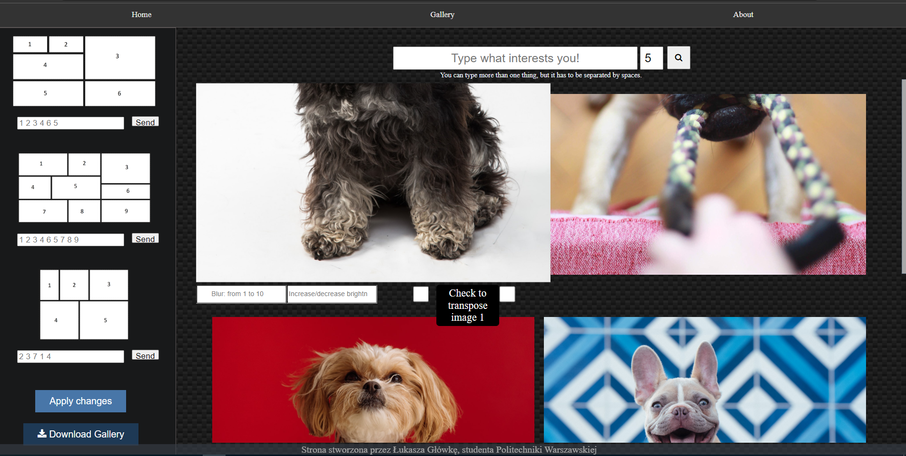

###Projekt wykonany na zaliczenie przedmiotu PIPR na pierwszym semestrze Informatyki
---

  

Aplikacja galerii została zakodowana przy użyciu mikro frameworku aplikacji webowych napisany w języku Python. Styl stron HTML został zakodowany przy pomocy CSS, wraz z okazyjnym użyciem skryptu Javascript.

Aplikacja generuje galerię zdjęć przy użyciu API UnsplashSource. API to generuje czasami te same obrazy, ale ze względu na prędkość działania strony nie są one usuwane przez aplikację. Na obrazy można nałożyć rozmycie, zmniejszyć/zwiększyć jasność lub nałożyć transpozycje. Można je także usunąć z galerii.

Generowane obrazy (2-15) zostają wyświetlane na stronie i są dostępne do pobrania za pomocą przycisku. Pobrany plik zip zawiera zmodyfikowane obrazy.

Obrazy z galerii można przekazać do trzech szablonów, które generują kolaż z wybranych zdjęć. Aby pobrać ten kolaż należy kliknąć przycisk.

Aby uruchomić aplikację należy:

1. Przejść do folderu website.

2. Zainstalować wszystkie zależności z pliku requirements.txt za pomocą komendy ” pip install -r requirements.txt ”.

3. Utworzyć bazę danych za pomocą komendy ”python db_create.py” (lub python3).

4. Uruchomić aplikację wpisując komendę ”python app.py” (lub python3).

5. Otworzyć stronę znajdującą się pod podanym adresem (http://127.0.0.1:5000/).

Aby uruchomić testy należy:

1. Przejść do folderu website.

2. Uruchomić komendę ” python -m pytest .\test_api_operations.py” lub ”python -m pytest .\tests\test_api_operations.py”
